# Planora skill library

This directory is the repository-scoped Codex skill library. Codex discovers child skill packages from `.agents/skills`; this catalog is maintainer documentation and is not a skill.

## Design decisions

1. **Use `.agents/skills`.** This is the current official repository discovery location. The existing `.codex` directory remains runtime-local.
2. **Use one base gate plus narrow specialists.** `$planora-workflow` owns preflight, approvals, validation selection, and handoff. It never owns domain work.
3. **Encode the mode in the verb.** `investigate-*` diagnoses, `implement-*` and `change-*` mutate behavior, `review-*` and `audit-*` report findings, and `verify-*` proves outcomes.
4. **Split by evidence and risk boundary.** Auth, migrations, storage, email, notifications, Azure, containers, responsive UI, accessibility, and visual design require different inputs and verification.
5. **Merge indistinguishable workflows.** Root-cause analysis is part of `$investigate-bug`; GitHub Actions debugging is part of `$investigate-ci`; UX consistency and visual polish share `$review-ux-visuals`.
6. **Keep API contract modes separate.** `$change-api-contract` implements intentional evolution; `$review-api-contract` audits compatibility.
7. **Separate performance diagnosis from optimization.** No tuning begins until `$investigate-performance` establishes a baseline and dominant cost.
8. **Make general review a router.** `$review-code` finds broad defects and invokes specialist reviews; it must not duplicate their findings.
9. **Keep current source authoritative.** Historical audits and roadmaps are context. Skills require current-code confirmation before opening work.
10. **Do not vendor broad external skills.** The official ASP.NET Core skill was evaluated but overlaps most of this catalog; curated GitHub CI capabilities are already available through the installed GitHub plugin. Repo skills remain self-contained and Planora-specific.

## Catalog

| Family | Skills |
|---|---|
| Base | `planora-workflow` |
| Diagnose | `investigate-bug`, `investigate-performance`, `investigate-ci` |
| Implement | `implement-endpoint`, `implement-blazor-feature`, `change-api-contract`, `optimize-performance` |
| Verify | `add-tests`, `run-integration-tests`, `verify-regression` |
| General review | `review-code`, `review-architecture`, `review-tech-debt`, `review-release` |
| API/data/security | `review-api-contract`, `review-authz`, `audit-security`, `review-ef-core`, `review-migration`, `review-dependencies` |
| UI | `review-blazor-ui`, `audit-responsive-ui`, `audit-accessibility`, `review-ux-visuals` |
| Operations | `review-observability`, `review-error-handling`, `review-azure-deployment`, `review-container` |
| Integrations | `review-blob-storage`, `review-email-workflow`, `review-notifications` |

## Natural-language routing

| User request | Initial skills | Follow-on composition |
|---|---|---|
| “Fix this bug.” | `planora-workflow` + `investigate-bug` | Owning implementation skill + `verify-regression` |
| “Create a new endpoint.” | `planora-workflow` + `implement-endpoint` | `change-api-contract`, `review-authz`, tests |
| “Build this frontend feature.” | `planora-workflow` + `implement-blazor-feature` | UI, responsive, accessibility, and contract skills by scope |
| “Review this PR.” | `planora-workflow` + `review-code` | Specialist review skills selected from touched files |
| “Investigate this issue.” | `planora-workflow` + `investigate-bug` | Switch to performance or CI investigation only when evidence points there |
| “Improve performance.” | `planora-workflow` + `investigate-performance` | `optimize-performance` only after a measured bottleneck |
| “Are we ready to release?” | `planora-workflow` + `review-release` | Migration, dependency, security, container, and Azure reviews by diff |

## Dependency graph

Arrows mean “normally composes with or hands off to,” not mandatory invocation for every task.

```mermaid
flowchart TD
    PW[planora-workflow]

    PW --> BUG[investigate-bug]
    PW --> PERF[investigate-performance]
    PW --> CI[investigate-ci]
    PW --> CODE[review-code]
    PW --> REL[review-release]

    BUG --> EP[implement-endpoint]
    BUG --> BZ[implement-blazor-feature]
    BUG --> REG[verify-regression]
    PERF --> OPT[optimize-performance]
    CI --> INT[run-integration-tests]

    EP --> CONTRACT[change-api-contract]
    EP --> AUTH[review-authz]
    EP --> EF[review-ef-core]
    EP --> ERR[review-error-handling]
    BZ --> BZR[review-blazor-ui]
    BZ --> RESP[audit-responsive-ui]
    BZ --> A11Y[audit-accessibility]
    BZ --> UX[review-ux-visuals]
    CONTRACT --> CAR[review-api-contract]

    CODE --> ARCH[review-architecture]
    CODE --> AUTH
    CODE --> SEC[audit-security]
    CODE --> EF
    CODE --> MIG[review-migration]
    CODE --> DEP[review-dependencies]
    CODE --> BZR
    CODE --> OBS[review-observability]

    EF --> MIG
    REG --> TEST[add-tests]
    TEST --> INT

    REL --> MIG
    REL --> DEP
    REL --> SEC
    REL --> CON[review-container]
    REL --> AZ[review-azure-deployment]
    AZ --> CON
    AZ --> BLOB[review-blob-storage]
    AZ --> EMAIL[review-email-workflow]
    AZ --> OBS
    NOTIF[review-notifications] --> EMAIL
    NOTIF --> AUTH
```

## Maintenance rules

- Add a skill only when its trigger, evidence, workflow, or output materially differs from every existing skill.
- Keep frontmatter descriptions concise and front-load trigger words because Codex may shorten metadata.
- Preserve the required sections: Inputs, Boundaries, Workflow, Verification, Outputs, Composition.
- Run `_tools/validate-library.ps1` and the official `quick_validate.py` for every skill after changes.
- Forward-test ambiguous routing with realistic prompts before trusting new or changed descriptions.
