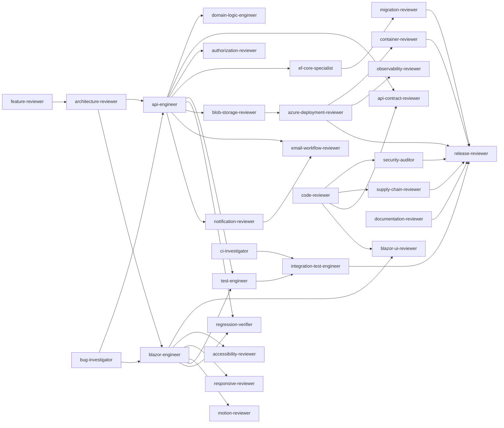
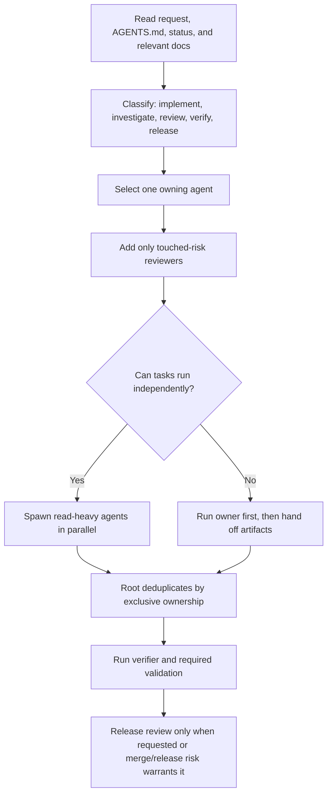

# Planora custom subagents

Planora uses project-scoped Codex custom agents from `.codex/agents/*.toml`. The roster is not a
one-to-one copy of the repository Skill catalog: Skills are reusable procedures; agents are durable
expert identities with authority, limits, model routing, and collaboration contracts. A few
repository-specific integration agents intentionally compose the same narrow Skills from different
change contexts.

The root agent reads `AGENTS.md`, applies `planora-workflow`, chooses the smallest agent set, and
mediates all handoffs through [PROTOCOL.md](PROTOCOL.md). Reviewers default to read-only sandboxes.
Implementers inherit the parent permission mode because they may need workspace writes.

## Roster

| Group | Agent | Exclusive ownership |
|---|---|---|
| Architecture | `architecture-reviewer` | Boundaries, dependency direction, subsystem design |
| Architecture | `tech-debt-reviewer` | Evidence-ranked recurring engineering cost |
| Architecture | `refactoring-specialist` | Behavior-preserving structural changes |
| Backend | `api-engineer` | Controller/Application endpoint slices |
| Backend | `domain-logic-engineer` | Application/Domain business invariants independent of HTTP |
| Backend | `auth-session-specialist` | Login, JWT, refresh, lockout, 2FA, sessions |
| Backend | `authorization-reviewer` | Workspace roles, tenancy, IDOR |
| Backend | `ef-core-specialist` | Entities, configurations, queries, tracking, transactions |
| Backend | `migration-reviewer` | Generated PostgreSQL migrations and rollout safety |
| Frontend | `blazor-engineer` | Blazor feature implementation through typed services |
| Frontend | `blazor-ui-reviewer` | Component state, lifecycle, JS interop, drag/drop, failures |
| Frontend | `ux-design-reviewer` | Flow clarity, hierarchy, tokens, visual consistency, dark mode |
| Frontend | `accessibility-reviewer` | Keyboard, focus, semantics, assistive technology, contrast |
| Frontend | `responsive-reviewer` | Viewports, touch, orientation, safe areas, overflow |
| Frontend | `motion-reviewer` | Animation invariants, reduced motion, stacking-context effects |
| Quality | `code-reviewer` | Cross-cutting correctness scan and specialist routing |
| Quality | `test-engineer` | Focused unit/integration coverage design and implementation |
| Quality | `integration-test-engineer` | PostgreSQL-backed suite execution and environment diagnosis |
| Quality | `bug-investigator` | Reproduction and root-cause isolation |
| Quality | `regression-verifier` | Before/after proof that a fix closes the reported defect |
| Security | `security-auditor` | Threat models, trust boundaries, input/provider abuse |
| Security | `supply-chain-reviewer` | NuGet, Actions, images, and vendored dependencies |
| Security | `secret-leak-reviewer` | Secrets in source, config, logs, diffs, and artifacts |
| Performance | `backend-performance-reviewer` | API, EF, startup, throughput, allocations, memory lifetime |
| Performance | `frontend-performance-reviewer` | Blazor rendering, payload, interop, polling, browser memory |
| DevOps | `ci-investigator` | GitHub Actions failures and flakiness |
| DevOps | `container-reviewer` | Dockerfile and Compose build/runtime behavior |
| DevOps | `azure-deployment-reviewer` | Azure workflow, config mapping, rollout, rollback, probes |
| DevOps | `observability-reviewer` | Logs, correlation, health, provider/job diagnostics |
| Integrations | `blob-storage-reviewer` | Upload validation, private blobs, SAS reads, cleanup, dual-read |
| Integrations | `email-workflow-reviewer` | Transactional email security, preferences, privacy, failure isolation |
| Integrations | `notification-reviewer` | In-app notification creation, scope, lifecycle, links, polling |
| Product | `feature-reviewer` | Requirement completeness and user-visible acceptance |
| Product | `api-contract-reviewer` | Shared DTO/route/validation/serialization compatibility |
| Product | `documentation-reviewer` | Current-code documentation consistency and maintainability |
| Product | `release-reviewer` | Evidence-based go/conditional-go/no-go decision |

## Hierarchy

```mermaid
flowchart TD
    ROOT["Root orchestrator"]
    ROOT --> ARCH["Architecture"]
    ROOT --> BACK["Backend"]
    ROOT --> FRONT["Frontend"]
    ROOT --> QUAL["Quality"]
    ROOT --> SEC["Security"]
    ROOT --> PERF["Performance"]
    ROOT --> OPS["DevOps"]
    ROOT --> INTEG["Integrations"]
    ROOT --> PROD["Product and release"]

    ARCH --> AR["architecture-reviewer"]
    ARCH --> TD["tech-debt-reviewer"]
    ARCH --> RF["refactoring-specialist"]
    BACK --> API["api-engineer"]
    BACK --> DOMAIN["domain-logic-engineer"]
    BACK --> AUTHN["auth-session-specialist"]
    BACK --> AUTHZ["authorization-reviewer"]
    BACK --> EF["ef-core-specialist"]
    BACK --> MIG["migration-reviewer"]
    FRONT --> BZ["blazor-engineer"]
    FRONT --> UIR["blazor-ui-reviewer"]
    FRONT --> UX["ux-design-reviewer"]
    FRONT --> A11Y["accessibility-reviewer"]
    FRONT --> RESP["responsive-reviewer"]
    FRONT --> MOTION["motion-reviewer"]
    QUAL --> CR["code-reviewer"]
    QUAL --> TEST["test-engineer"]
    QUAL --> INT["integration-test-engineer"]
    QUAL --> BUG["bug-investigator"]
    QUAL --> REG["regression-verifier"]
    SEC --> SA["security-auditor"]
    SEC --> DEP["supply-chain-reviewer"]
    SEC --> SECRET["secret-leak-reviewer"]
    PERF --> BP["backend-performance-reviewer"]
    PERF --> FP["frontend-performance-reviewer"]
    OPS --> CI["ci-investigator"]
    OPS --> CONT["container-reviewer"]
    OPS --> AZ["azure-deployment-reviewer"]
    OPS --> OBS["observability-reviewer"]
    INTEG --> BLOB["blob-storage-reviewer"]
    INTEG --> EMAIL["email-workflow-reviewer"]
    INTEG --> NOTIF["notification-reviewer"]
    PROD --> FEAT["feature-reviewer"]
    PROD --> CONTRACT["api-contract-reviewer"]
    PROD --> DOC["documentation-reviewer"]
    PROD --> REL["release-reviewer"]
```

## Collaboration graph

Arrows are handoffs, not duplicate reviews. The root carries each handoff envelope.

## Invocation flow

Use at most one implementation owner per file set. Parallelize exploration, review, test execution,
and log analysis. Do not parallelize writers that touch the same files.

## Automatic routing signals

| Touched path or signal | Owner | Add these independent reviewers when material |
|---|---|---|
| `Planora.Shared/**`, routes, JSON/status changes | `api-engineer` for implementation | `api-contract-reviewer`, then affected Web/API owner |
| `Planora.Api/Controllers/**`, validators, mappers | `api-engineer` | `authorization-reviewer`, `api-contract-reviewer`, `test-engineer` |
| `Planora.Api/Application/Services/**`, domain transitions | `domain-logic-engineer` | `architecture-reviewer`, `authorization-reviewer`, `test-engineer` |
| AuthController, token/refresh/2FA/session paths | `auth-session-specialist` after approval | `security-auditor`, `test-engineer`, `regression-verifier` |
| EF entities/configurations/queries | owning implementer after `ef-core-specialist` design | `authorization-reviewer`, `backend-performance-reviewer` |
| `Planora.Api/Migrations/**` or model snapshot | generated by owning implementer | `migration-reviewer`, `release-reviewer` for rollout |
| `Planora.Web/**/*.razor`, Web services, JS interop | `blazor-engineer` | `blazor-ui-reviewer` plus only touched UX/a11y/responsive/motion lenses |
| Uploads, `IFileStorage`, media URL resolution | owning backend engineer | `blob-storage-reviewer`, `authorization-reviewer`, `security-auditor` |
| Email triggers/templates/providers | owning backend engineer | `email-workflow-reviewer`, `secret-leak-reviewer`, `observability-reviewer` |
| Notification entity/controller/Web consumption | owning backend/Web engineer | `notification-reviewer`, `authorization-reviewer` |
| `.csproj`, Actions, base images, vendored libraries | owning implementer | `supply-chain-reviewer` |
| `.github/workflows/**`, Azure config | approval gate first | `ci-investigator` for failures; `azure-deployment-reviewer` for changes |
| Dockerfile, Compose, container runtime | owning implementer | `container-reviewer`, then `azure-deployment-reviewer` if deployed |
| `Planora.Tests/**` new coverage | `test-engineer` | `integration-test-engineer` executes; domain specialist confirms assertions |
| Reported defect | `bug-investigator` first | fixing owner, `test-engineer`, then `regression-verifier` |
| Release request | `release-reviewer` | only specialists selected by the exact release diff |

## Common task examples

| Task | Owning sequence | Parallel risk review |
|---|---|---|
| Add a workspace-scoped endpoint and UI | `feature-reviewer` -> `architecture-reviewer` when boundary choice is material -> `api-engineer` -> `blazor-engineer` | `api-contract-reviewer`, `authorization-reviewer`, `test-engineer`; then `integration-test-engineer` |
| Add a business invariant without a new route | `domain-logic-engineer` | `ef-core-specialist`, `authorization-reviewer`, `test-engineer` as touched |
| Fix cross-workspace data exposure | `bug-investigator` -> approval gate -> `api-engineer` -> `regression-verifier` | `authorization-reviewer`, `security-auditor`, `test-engineer` |
| Add a column and migration | `ef-core-specialist` -> `migration-reviewer` -> owning implementer | `authorization-reviewer`, `backend-performance-reviewer`, `test-engineer` |
| Repair a drag/drop regression | `bug-investigator` -> `blazor-engineer` -> `regression-verifier` | `blazor-ui-reviewer`, `responsive-reviewer`, `motion-reviewer` if CSS/animation changed |
| Investigate slow board load | `backend-performance-reviewer` and `frontend-performance-reviewer` measure independently | `ef-core-specialist` only when SQL is implicated; implementation starts after a dominant cost is proven |
| Fix a red GitHub Actions run | `ci-investigator` -> owning implementer | `integration-test-engineer` for PostgreSQL failures; `container-reviewer` for Docker failures |
| Change Azure deployment | approval gate -> `azure-deployment-reviewer` | `container-reviewer`, `secret-leak-reviewer`, `observability-reviewer`, then `release-reviewer` |
| Review a pull request | `code-reviewer` triages the diff | Spawn only the specialists selected from touched files; `release-reviewer` aggregates without repeating findings |
| Update product documentation | `documentation-reviewer` | `feature-reviewer` for product claims, `api-contract-reviewer` for endpoint claims |

## Deliberate merges and exclusions

- Validation is not a standalone agent: `api-engineer` owns validator implementation and
  `api-contract-reviewer` independently checks create/update parity and failure semantics.
- Root-cause analysis is the core responsibility of `bug-investigator`; a second root-cause agent
  would duplicate evidence and ownership.
- Memory review is split by runtime: server allocations/retention belong to
  `backend-performance-reviewer`; browser/event/component lifetime belongs to
  `frontend-performance-reviewer`.
- Azure and generic deployment review are one agent because Planora's production deployment surface
  is Azure Container Apps plus Static Web Apps. `container-reviewer` remains separate because its
  evidence is local image/runtime behavior.
- UX and design-system review are merged because both use the same tokens, component states,
  hierarchy, and rendered evidence. Motion remains separate because Planora has strict Blazor
  lifecycle and stacking-context animation hazards.
- No generic backend, frontend, security, or DevOps agent exists. The root uses the narrow owner or
  a built-in worker when no durable specialty is warranted.

## Maintenance

- Add an agent only when its evidence, authority, and output differ from every existing agent.
- Add a Skill when a repeatable procedure is missing; add an agent when a durable expert identity is missing.
- Keep reviewer sandboxes read-only and `max_depth = 1`.
- Forward-test routing with realistic prompts and run
  `python .codex/agents/_tools/validate_agents.py` after every profile change.
- Reconcile the roster whenever architecture, deployment, or the Skill catalog changes.
