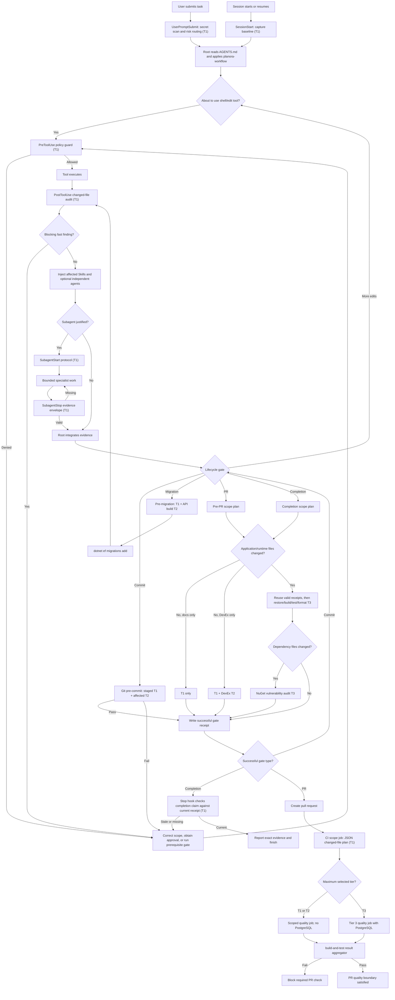

# Planora Codex Hooks

## Decision

Planora uses one changed-file classifier and one validation orchestrator. Native Codex hooks are
thin Tier 1 adapters around that engine; Git commit, migration, pull-request, and task-completion
gates call the same engine explicitly. This avoids concurrent hooks starting duplicate builds and
keeps expensive work out of the edit loop.

The executable policy lives in:

- `.codex/hooks.json` — native Codex lifecycle bindings;
- `.codex/hooks/policy.json` — categories, Skill/subagent routing, and hook metadata;
- `.codex/hooks/planora_hooks.py` — classifier, guards, validation planner, cache, and hook handlers;
- `.githooks/pre-commit` — blocking Git commit gate;
- `scripts/Invoke-PlanoraQuality.ps1` — explicit migration, PR, and completion entry point;
- `.codex/hooks/tests/test_planora_hooks.py` — regression coverage.

Codex currently executes only command hook handlers. `prompt` and `agent` handler types are parsed but
skipped. Consequently, hooks inject precise Skill/subagent routing into the active agent; they do not
pretend to invoke a Skill or spawn an agent directly. `SubagentStart` and `SubagentStop` enforce the
existing `.codex/agents/PROTOCOL.md` around subagents that the root agent intentionally selects.
The supported events, payloads, trust model, and handler limits are taken from the current
[Codex Hooks documentation](https://learn.chatgpt.com/docs/hooks.md).

## Setup

1. Enable the repository Git hook once:

   ```powershell
   powershell -NoProfile -ExecutionPolicy Bypass -File scripts/Install-PlanoraHooks.ps1
   ```

2. Open `/hooks` in Codex, inspect `.codex/hooks.json`, and trust it. Codex hashes command hook
   definitions; a changed definition must be reviewed again.
3. Keep Python 3 and PowerShell available. The application itself still requires the .NET 10 SDK and
   PostgreSQL on port 5433 for integration tests.

The installer changes only the local repository setting `core.hooksPath=.githooks`. It does not
commit, push, modify CI, or touch production resources.

## Three execution tiers

| Tier | Runtime contract | Frequency | Allowed work | Prohibited work |
|---|---:|---|---|---|
| Tier 1 — Fast | each native handler ≤2 s | prompts, starts, edits, tool calls, stops | classification, clear-secret detection, protected-path checks, diff/whitespace inspection, lightweight architecture checks, cache/receipt lookup | builds, test suites, restore, provider/network audits, agent-based broad reviews |
| Tier 2 — Targeted | each check ≤30 s | relevant staged changes, pre-migration, DevEx completion | affected project/contract build, formatter, Skill/agent-library validators, hook regression tests | full solution test suite, broad security/release review, E2E, profiling |
| Tier 3 — Expensive | gate ≤900 s | only PR/completion and only for application/runtime changes | restore, Release build, full PostgreSQL suite, format, dependency vulnerability audit when dependencies changed | edit-loop execution |

Runtime limits are enforced by the command orchestrator. A timeout is a blocking failure, not a
warning or an excuse to mark the task complete.

## Hook inventory

The inventory below mirrors the machine-readable entries in `.codex/hooks/policy.json`.

### Tier 1 native hooks

| Hook | Trigger and frequency | Purpose and execution conditions | Order | Scope | Cache/reuse | Failure behavior | Why it exists |
|---|---|---|---:|---|---|---|---|
| `task-intake` | `UserPromptSubmit`, every prompt; max 1 s | Blocks only unmistakable private-key/API-token patterns. Classifies risk keywords and injects `planora-workflow`, specialist Skills, candidate agents, and the completion command. | 1 | prompt text; no repository build | stores the turn-start repository fingerprint; other output is not cached | confirmed secret blocks prompt; risk routing only warns | prevents accidental prompt secret disclosure and makes QA routing automatic before work starts |
| `session-orientation` | `SessionStart` on startup/resume/clear/compact; max 1 s | Records a baseline and injects current changed categories plus preservation/completion rules. | 2 | current worktree | per-turn baseline, pruned to 50 records | never blocks; malformed/missing state is recreated | prevents pre-existing user changes from being mistaken for changes made by the new task |
| `pre-tool-policy` | `PreToolUse` before supported shell/edit calls; max 2 s | Denies destructive Git/database commands, direct generated-migration edits, migrations without a current pre-migration receipt, PR creation without a current PR receipt, and build/test/format while `dotnet watch` is detected. Warns on approval-gated CI/push/deploy actions and injects risk routing. | 3 | tool command and edit target paths | reuses current migration/PR receipts | policy violation blocks the tool; approval/routing concerns warn | prevents high-cost or irreversible mistakes before side effects occur |
| `post-edit-audit` | `PostToolUse` after supported file-edit calls; max 2 s | Reclassifies the whole changed set, scans changed text for clear secrets, checks protected paths, staged/unstaged diff whitespace, and Web/Shared boundary violations; then injects the next Skills/agents. Read-only shell calls do not trigger it. | 4 | changed tracked and untracked files | deterministic changed-file fingerprint; no build result | critical finding replaces the tool result with blocking feedback; noncritical architecture/whitespace findings warn | catches mistakes immediately without paying for a build after every edit or latency after every read |
| `subagent-start` | `SubagentStart`, every subagent; max 1 s | Injects AGENTS/PROTOCOL, narrow Skill ownership, no-recursion, and approval limits. | 5 | selected agent type | none | never blocks | keeps delegated work bounded and consistent with the existing agent library |
| `subagent-stop` | `SubagentStop`, every subagent; max 1 s | Checks the required `STATUS/SCOPE/EVIDENCE/OUTPUT/RISKS/VALIDATION/HANDOFFS` envelope. | 6 | last subagent message | `stop_hook_active` prevents loops | requests one retry when fields are missing; second stop continues | makes agent output auditable without spawning another reviewer |
| `completion-evidence` | `Stop`, every turn; max 2 s | Does nothing for progress updates or unchanged turns. If the agent claims completion after changing files, it verifies a current completion receipt. | 7 | turn baseline, current changed files, last assistant message | completion receipt keyed by exact content/HEAD/tool policy | asks Codex to continue once and run completion validation; loop guard prevents repeated continuation | stops unsupported “done” claims while avoiding a full pipeline at every conversational stop |

### Tier 2 and Tier 3 simulated lifecycle gates

| Hook/gate | Trigger and frequency | Purpose and execution conditions | Order | Changed-file scope | Cache/reuse | Failure behavior | Why it exists |
|---|---|---|---:|---|---|---|---|
| `pre-commit` | Git `pre-commit`, every commit; max 30 s per check | Runs Tier 1 on staged files, then agent/Skill/hook validators for DevEx, one affected build for API/Web/contracts, and format for .NET/UI sources. | 8 | staged files only | each successful check reused by content fingerprint; a contract build replaces duplicate project builds | any failed/timeout check blocks commit | prevents locally detectable defects from reaching a PR without forcing the integration suite on each commit |
| `pre-migration` | explicit command immediately before `dotnet ef migrations add`; max 30 s | Requires changed backend/database model scope, then runs fast audit and a clean affected API build. Receipt is required by PreToolUse before migration generation. | 8 | current API/data/model changes | receipt valid only for exact pre-generation content | empty scope, build failure, or timeout blocks generation | prevents empty migrations and migrations generated from uncompilable or unsafe working state |
| `pre-pr` | `scripts/Invoke-PlanoraQuality.ps1 -Gate pr`, once before PR creation; max 900 s | Uses merge-base-to-`origin/main` plus worktree. Docs-only stays Tier 1; DevEx-only stays Tier 1+2; application/runtime changes add restore, Release build, full test, format, and dependency audit when relevant. | 9 | complete proposed PR diff | shares per-check results with completion when HEAD/content/command/tool versions match | any failure blocks PR creation through PreToolUse | gives high confidence at the external-review boundary without taxing ordinary edits |
| `task-completion` | `scripts/Invoke-PlanoraQuality.ps1 -Gate completion`, once before final response; max 900 s | Same scope-sensitive selection as PR, using the worktree. Writes the receipt checked by `Stop`; prunes local turn state while writing results atomically. | 10 | changed tracked/untracked worktree files | shares results with pre-PR; exact fingerprint invalidation | any failure blocks a supported completion claim | makes acceptance evidence automatic and reusable while keeping docs-only tasks fast |

## Requested lifecycle mapping

Several requested names are file categories, not distinct lifecycle events. They intentionally map to
one pre-tool and one post-tool hook so matching command hooks do not launch concurrently and duplicate
work.

| Requested event | Implementation | Native? | Action selected by classifier |
|---|---|---:|---|
| before reading/starting a task | `UserPromptSubmit` + `SessionStart` | yes | prompt secret gate, task risk routing, baseline capture |
| before editing files | `PreToolUse` | yes | protected-path/destructive-action guard, Skill/agent context |
| before backend/frontend/auth/API/database/UI/config/dependency modifications | `PreToolUse` categories | yes | warn/deny by risk; never build |
| before creating migrations | `pre-migration` receipt + `PreToolUse` enforcement | mixed | fast audit, API build, then allow `dotnet ef migrations add` |
| before commits | `.githooks/pre-commit` | Git native, not Codex native | staged Tier 1 + relevant Tier 2 |
| before pull requests | `pre-pr` receipt + `PreToolUse` enforcement of `gh pr create` | simulated gate | scope-sensitive Tier 1/2/3 |
| before task completion | `task-completion` + `Stop` receipt enforcement | mixed | scope-sensitive Tier 1/2/3 |
| after backend/frontend/auth/API/database/UI/config/dependency file edits | one `PostToolUse` classifier | yes | Tier 1 audit and precise next-check/Skill/agent routing |
| after tests | orchestrator records each check result atomically | simulated inside gate | success cached; failure stops later checks |
| after task completion | successful completion receipt and bounded state cleanup | simulated inside gate | no second build or redundant “post-completion” suite |

There is deliberately no separate “after backend,” “after API,” or “after UI” command hook. Codex
launches matching command hooks for the same event concurrently, so separate hooks would all inspect
the same diff and could not coordinate cache ownership reliably.

## Changed-file classification and routing

The classifier accepts tracked unstaged, staged, and untracked non-ignored files. PR mode adds the
merge-base diff against `origin/main`. Categories may overlap because overlap represents risk, not
duplicate execution: for example, `AuthController.cs` is backend, API contract, authentication, and
security. Check selection deduplicates commands afterward.

Important routing examples:

| Category | Skills injected | Candidate specialist agents | Automated checks |
|---|---|---|---|
| backend | `implement-endpoint` | `api-engineer` | API build at commit; full release gates at PR/completion |
| frontend/UI | `implement-blazor-feature`, `review-blazor-ui`, accessibility/responsive/visual audits | `blazor-engineer`, `blazor-ui-reviewer` | Web build + format at commit; full release gates later |
| Shared/API contract | `change-api-contract`, `review-api-contract` | `api-contract-reviewer` | one full solution contract build, replacing project builds |
| authentication/authorization/security | `review-authz`, `audit-security` | auth/session, authorization, security specialists | build early; full negative/integration suite at final gate |
| database/migration | `review-ef-core`, `review-migration` | EF and migration specialists | pre-migration API build; final full suite |
| dependencies | `review-dependencies` | supply-chain reviewer | final vulnerability audit only when dependency files changed |
| CI/container/config | CI, Azure, container, observability Skills | matching DevOps specialists | warning/approval gate early; Tier 3 at PR/completion when runtime-affecting |
| DevEx | existing agent/Skill validators plus hook tests | no agent by default | no .NET build/test unless application files also changed |

Skills remain procedures and agents remain independent expert identities. The root agent invokes a
specialist only when the review can run independently and has distinct evidence. A hook never spawns
all candidates merely because their category matched.

## Validation plan and command selection

The orchestrator stops at the first failure because downstream `--no-build` tests would otherwise
produce misleading noise.

```text
Tier 1: fast-audit

Tier 2, conditional:
  DevEx      -> validate agents -> validate Skills -> hook unit tests
  API        -> API build
  Web/UI     -> Web build
  contract   -> full solution build (replaces API/Web build)
  .NET/UI    -> dotnet format --verify-no-changes --no-restore --include <changed source>

Tier 3, conditional on application/runtime changes:
  restore -> Release build -> full tests -> changed-source release format
  dependency files -> transitive vulnerability audit
```

No JavaScript lint, bUnit, Playwright, or repository E2E command is invented: none exists. UI hooks
route rendered-browser, accessibility, responsive, and visual verification to the active agent and
existing specialist Skills. Performance profiling is also excluded from automatic Tier 3 because it
has no stable baseline and would add latency without a measurable pass/fail signal.

## Cache and reuse

Results live in ignored `.codex/cache/results.json`. A check fingerprint includes:

- exact relevant changed-file paths and contents, including deletions;
- the full affected project/Skill/agent/hook input scope for builds and tests, and exact changed
  source paths for formatter checks;
- repository inputs only: generated `bin`/`obj`, caches, logs, and ignored runtime uploads are
  excluded so a test run cannot invalidate its own successful fingerprint;
- check id and full command;
- current hook engine and policy contents;
- current `dotnet --version`.

A successful result is reusable only when the fingerprint is identical. Failed checks are never
reused. Any relevant edit, command/policy update, SDK change, or deletion invalidates the result;
committing identical content does not. `-Force` bypasses reuse. Completion and PR gates share
identical check receipts, so running completion and then opening a PR does not repeat a successful
full suite when nothing changed.

Receipts are written atomically through a temporary file and contain no source content or secrets.
The cache is local and ignored.

## Failure and warning policy

Blocking failures:

- clear secret patterns in a prompt, tool input, or changed file;
- protected local secret/certificate/build-output paths entering the diff;
- destructive history or database commands forbidden by `AGENTS.md`;
- direct edits of generated migration artifacts;
- migration generation without a current pre-migration receipt;
- PR creation without a current PR receipt;
- builds/tests/format while a `dotnet watch` process is detected;
- any selected build, test, format, validator, vulnerability audit, or timeout failure;
- any hook evaluation error that would leave policy state unknown;
- a completion claim without a current completion receipt.

Warnings:

- CI/CD, push, merge, deploy, security-sensitive, or production-configuration approval gates;
- lightweight architecture boundary findings that require contextual review;
- selected Skills and candidate independent agents;
- missing browser/UI automation that needs a documented manual/specialist check.

PostToolUse cannot undo an edit that already ran; a block replaces the tool result with corrective
feedback so Codex must remove the issue before continuing.

## Removed and merged hooks

- All “before backend/frontend/auth/API/database/UI” hooks were merged into `pre-tool-policy`.
- All matching “after modification” hooks were merged into `post-edit-audit`.
- `PermissionRequest` was rejected because it would duplicate PreToolUse and fires only for actions
  already requesting approval.
- `PreCompact`/`PostCompact` were rejected because SessionStart already reorients after compaction and
  no quality defect is prevented by another script.
- A generic after-test hook was rejected because only the orchestrator can safely associate the exact
  command, inputs, exit status, and fingerprint.
- An after-completion build was rejected because validation after the final claim is too late and
  duplicates the completion receipt.
- Direct Skill/agent handlers were rejected because current Codex skips those handler types.
- Automatic performance, full security, robustness, Playwright, and E2E scans were rejected where the
  repository lacks a deterministic command/baseline. Existing Skills remain available when the exact
  diff warrants them.

## Complete execution flow



## Demonstrating bounded work

Plans can be inspected without running commands:

```powershell
python .codex/hooks/planora_hooks.py plan --gate completion README.md
python .codex/hooks/planora_hooks.py plan --gate commit Planora.Api/Application/Services/AccountService.cs
python .codex/hooks/planora_hooks.py plan --gate commit Planora.Web/Pages/Board.razor
python .codex/hooks/planora_hooks.py plan --gate completion Planora.Api/Controllers/BoardsController.cs
python .codex/hooks/planora_hooks.py plan --gate pr --json README.md
```

Expected shape:

- `README.md` -> `T1:fast-audit` only;
- isolated backend commit -> API build + format, no Web build or full tests;
- isolated frontend commit -> Web build + format, no API build or full tests;
- application completion -> Tier 3 full validation;
- `.codex/**`/`.agents/**` only -> fast audit + library/hook tests, no .NET pipeline.

## CI boundary

GitHub Actions calls the same orchestrator and uses its machine-readable PR plan before provisioning
expensive resources:

- `scope` fetches full Git history, classifies the merge-base diff, emits the selected checks, and
  decides whether Tier 3 is required;
- `scoped-quality` handles documentation and DevEx-only PRs with Tier 1/2 checks and no PostgreSQL or
  .NET SDK setup;
- `tier3-quality` provisions PostgreSQL and runs the complete orchestrated PR gate only for
  application/runtime, dependency, CI, container, or security scope;
- `main-quality` preserves the previous unconditional restore, Release build, and full test suite for
  pushes to `main` and manual dispatches;
- `build-and-test` is a result-only aggregator retaining the repository's existing required-check
  identity. It fails if the selected path fails or is cancelled.

Exactly one PR quality job runs after scope detection. GitHub-hosted runs intentionally do not reuse
the ignored workstation cache; the clean runner is independent evidence. Within each run, the
orchestrator still removes duplicate project builds and stops on the first blocking failure.
Deployment workflows remain intentionally untouched.

## Troubleshooting

- Hook not running: trust it through `/hooks`, confirm the project `.codex` layer is trusted, and
  verify hooks are not disabled in config/managed policy.
- Commit hook not running: execute `scripts/Install-PlanoraHooks.ps1` and inspect
  `git config --get core.hooksPath`.
- Python missing: install Python 3 or expose it as `python` on Windows / `python3` elsewhere.
- Windows blocks the `.ps1` entry point: use
  `powershell -NoProfile -ExecutionPolicy Bypass -File scripts/Invoke-PlanoraQuality.ps1 -Gate <gate>`;
  this changes policy only for that process, matching the installed Git hook.
- Build blocked: stop all Planora `dotnet watch` processes first.
- Full tests fail to connect: start the throwaway-capable local PostgreSQL service on port 5433; do
  not point the suite at shared or production data.
- Suspected stale cache: run the gate with `-Force`; then inspect `.codex/cache/results.json`.
- Changed hook definition skipped: review and trust the new hash with `/hooks`.

## Enforcement limits

- Codex documents `PreToolUse` as a guardrail rather than a complete enforcement boundary: not every
  richer/streaming shell path is intercepted. `AGENTS.md`, the Git hook, PR checks, and completion
  receipts remain necessary defense-in-depth.
- Local Git hooks can be removed outside Codex. Visible `git commit --no-verify` calls are blocked,
  but repository hooks are not an operating-system security boundary.
- Secret scanning intentionally blocks only high-confidence token/key formats. It does not replace
  provider-side secret scanning, rotation, or human review of unusual credentials.
- Project Codex hooks do not run until the repository is trusted and the exact command-hook hash is
  reviewed. Managed policy can disable project hooks.
- UI correctness still needs rendered browser evidence because this repository has no Playwright or
  bUnit suite. The hook routes the existing UI/accessibility/responsive Skills instead of claiming
  nonexistent automation coverage.
